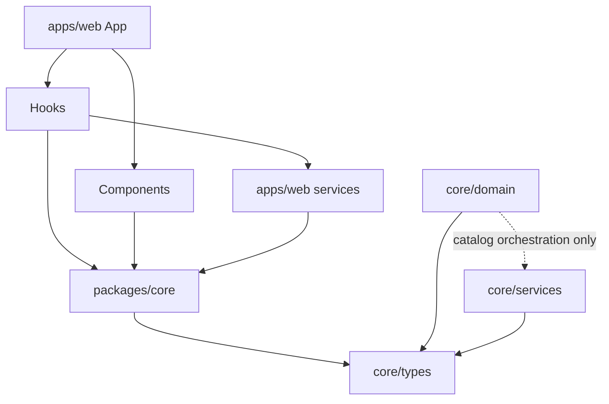
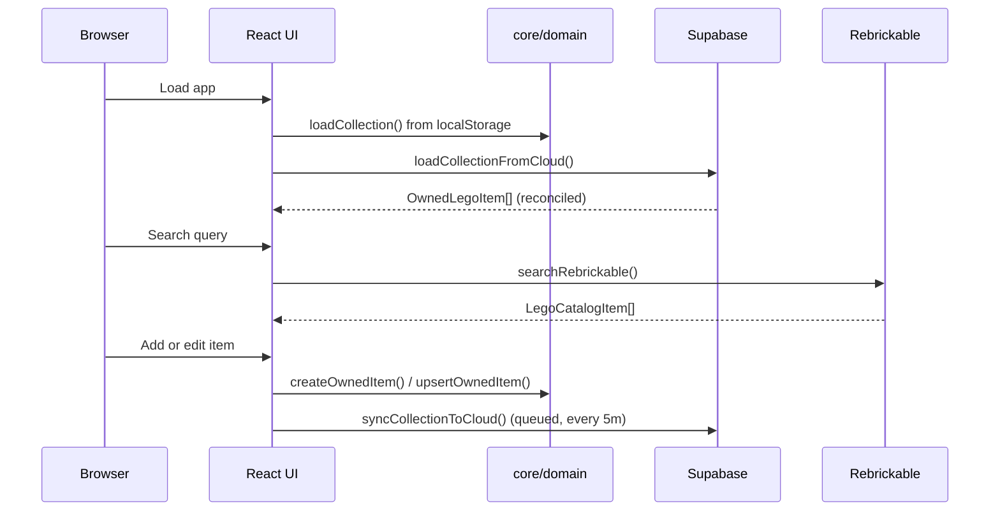
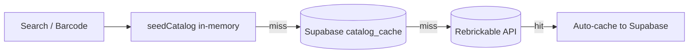

# Architecture

Anti-Kragle is a local-first web app with a shared domain model designed to be reused by a future iOS client.

## Goals

- Keep collection concepts in shared, explicit types.
- Isolate browser-only and network functionality behind service modules.
- Make catalog and sync backends replaceable without rewriting the UI.

## Monorepo Layout

```text
apps/web/            Vite + React web app
packages/core/       Shared domain logic, types, and services
supabase/functions/  Edge Functions (instructions scraper)
supabase/migrations/ Database schema
```

## Layers

| Layer | Path | Responsibility |
| --- | --- | --- |
| Types | `packages/core/src/types/` | Shared TypeScript contracts. No imports. |
| Domain | `packages/core/src/domain/` | Pure business logic: search, collection, summary, upsert, export. |
| Services | `packages/core/src/services/` | External integrations: Supabase, Rebrickable API. |
| Infrastructure | `packages/core/src/infrastructure/` | Cross-cutting browser utilities (e.g. `downloadBlob`). |
| App Services | `apps/web/src/services/` | Browser-local concerns: localStorage, sync queue, barcode. |
| Hooks | `apps/web/src/hooks/` | React hooks composing domain + services. |
| Components | `apps/web/src/components/` | React UI components. |
| App | `apps/web/src/app/` | Root application state and composition. |

## Dependency Direction



The domain layer must not import from the services layer, with one allowed
exception: `packages/core/src/domain/catalog.ts` imports from
`services/rebrickable` and `services/supabase` to orchestrate external catalog
lookup and its Supabase cache.

This is an **allowance, not debt**. It is encoded in `harness.config.json`, where
the `domain` layer lists `services` among its `allowedDependencies` with the
rationale *"Domain depends on services for external catalog orchestration and
caching."* The layer-boundary check passes on it by design; do not "fix" it
without changing that config first.

`catalog.ts` is the only domain module permitted to do this. Every other file
under `domain/` must stay free of service imports — the boundary still holds
everywhere else, and the architecture check enforces the reverse direction:
nothing in `services/` may import from `domain/`.

## Runtime Data Flow



## Authentication & Cloud Backup

Auth and session responsibility live in the **core services layer** — `packages/core/src/services/supabase.ts` — not in the web app. This keeps the domain/services boundary intact and avoids widening the known `catalog.ts` violation (decision **D5**).

### Core auth wrappers

| Function | Responsibility |
| --- | --- |
| `ensureAnonymousSession()` | Idempotent boot call: resumes an existing session or silently creates an anonymous one. Fails **open** — on error returns a typed `SessionResult` failure so callers keep working local-only. |
| `linkEmailIdentity(email)` | Promotes the current anonymous user to an email (magic-link) identity, preserving the same `uid` and all cloud rows. Returns a typed `LinkResult`. |
| `getSessionSnapshot()` | Synchronous read of the module-level session cache (`{ userId, isAnonymous }`) — lets the hook layer reflect state without importing the client. |
| `onSessionChange(cb)` | Subscribes to auth-state changes (used to reflect a magic-link return) and returns an unsubscribe function. |

These are the **only** auth surface the web app may touch, and it reaches them exclusively through the core public barrel (`@anti-kragle/core`) via the `apps/web/src/hooks/useAuth.ts` hook — never through a deep import. This is the RR-010 boundary in practice.

### Anonymous-backup + account-linking model

- On boot the web app calls `ensureAnonymousSession()` once. The default experience has **zero login friction**: an anonymous Supabase session is created and cloud backup begins immediately against `user_collection` (RLS-scoped by `auth.uid()`).
- The anonymous session token lives in `localStorage`, so a full site-data wipe orphans the cloud data. Linking an email identity (`linkEmailIdentity`) is the **optional** upgrade that protects the backup against total loss. Linking preserves the `uid`, so existing rows carry over with no data movement — no schema migration.
- When anonymous sign-in fails (offline, anon sign-ins disabled, or the per-IP rate cap), the app **fails open**: it stays fully usable local-only and surfaces `backupState === 'error'` (decision D6).

### Session-cache client

`getClient()` returns a **memoized singleton** Supabase client (previously a fresh client per call). A module-level session cache is kept fresh by an `onAuthStateChange` subscription, which backs the synchronous `getSessionSnapshot()`. Core tests reset this singleton via `__resetSupabaseClientForTests()` in `beforeEach`.

## Data Model

`LegoCatalogItem` — catalog data:

- `id`, `type` (set | minifig), `number`, `name`, `theme`, `year`
- `pieceCount`, `retired`, `estimatedValue`, `imageUrl`, `barcode?`

`OwnedLegoItem` extends `LegoCatalogItem` with ownership tracking:

- `status` (collection | wishlist), `acquiredQuality`, `savedBox`, `buildStatus`
- `displayLocation`, `notes`, `missingParts` (freeform string)
- `missingPartsList?: MissingSetPart[]` (structured missing parts, M6)
- `quantity`, `addedAt`, `updatedAt`

`SetPart` — parts list entry (M5):

- `partNum`, `partName`, `colorName`, `quantity`, `bagNum`, `imgUrl`, `isSpare`

`MissingSetPart` — subset of `SetPart` without bag/spare fields (M6)

`InstructionBooklet` — `{ title, url }` (M5)

`SyncQueueEntry` — `{ type: 'upsert', item } | { type: 'delete', itemId, deletedAt }`

## Persistence

**Local:** `brick-ledger.collection.v1` in localStorage. Validated with `isOwnedLegoItem()` on load.

**Cloud:** Supabase `user_collection` table, RLS-enforced per user. Sync queue (`brick-ledger.sync-queue.v1`) drains every 5 minutes or on reconnect.

**Parts cache:** Supabase `set_parts` table — lazy-fetched per set on first parts-list view.

**Catalog cache:** Supabase `catalog_cache` table — lazy-fetched from Rebrickable, seeded in bulk via `npm run seed-catalog`.

## Catalog Lookup Chain



## Future iOS Path

| Web Type | iOS Equivalent |
| --- | --- |
| `LegoCatalogItem` | Catalog DTO / Swift model |
| `OwnedLegoItem` | Persisted collection record |
| `CollectionStatus` | Swift enum |
| `AcquisitionQuality` | Swift enum |
| `BuildStatus` | Swift enum |
| `MissingSetPart` | Missing part record |

## Change Guidelines

- Put reusable business logic in `packages/core/src/domain/`.
- Put external API clients in `packages/core/src/services/`.
- Put browser-local concerns (localStorage, queue, camera) in `apps/web/src/services/`.
- Extend `packages/core/src/types/lego.ts` before adding ad hoc fields to UI state.
- Update `docs/user-guide.md` whenever visible behavior changes.
- Update this file when layer responsibilities or data flow change.
