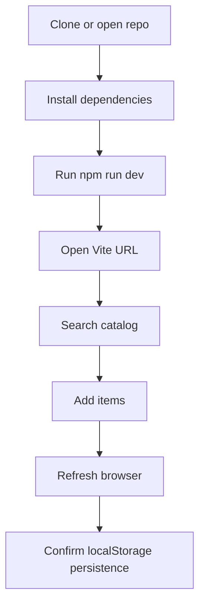

# Setup Guide

This guide covers local development, production build verification, and the browser requirements for Anti-Kragle.

## Requirements

- Node.js 18 or newer
- npm
- A modern browser
- Camera access if you want to test barcode scanning

Barcode scanning requires browser support for the Barcode Detection API. The app still works without it because the scanner modal includes manual barcode entry.

## Install

From the project root:

```bash
npm install
```

## Run Locally

```bash
npm run dev
```

Vite prints the local URL after startup. It is usually:

```text
http://localhost:5173/
```

The dev server is configured with `--host 0.0.0.0`, which allows access from other devices on the same network when your firewall allows it.

## Production Build

```bash
npm run build
```

The build runs TypeScript first, then Vite. Output is written to `dist/`.

Preview the built app:

```bash
npm run preview
```

## Harness Validation

This project was initialized with Harness metadata. Run:

```bash
harness validate
```

Use this as a quick project health check after documentation, code, or architecture changes.

## Environment Variables

The app integrates with the Rebrickable API for expanded catalog search. To enable this, you need a Rebrickable API key.

1. Create a `.env.local` file in the project root.
2. Add your API keys:

```text
# Required for expanded catalog search
VITE_REBRICKABLE_API_KEY=your_key_here

# Optional: for cloud storage features
VITE_SUPABASE_URL=your_project_url
VITE_SUPABASE_ANON_KEY=your_anon_key
```

You can obtain a Rebrickable API key by creating an account on [Rebrickable](https://rebrickable.com/api/). Supabase keys are found in your Supabase project dashboard under Project Settings -> API.

If the Rebrickable API key is missing, the app will continue to function using only the locally seeded catalog. Fallback to the local catalog applies only when this key is absent; other missing keys may disable their respective features.

## Browser Storage

Collection and wishlist data are saved under this browser localStorage key:

```text
brick-ledger.collection.v1
```

Use DevTools Application Storage to inspect or clear local saved data while testing.

## Setup Flow


