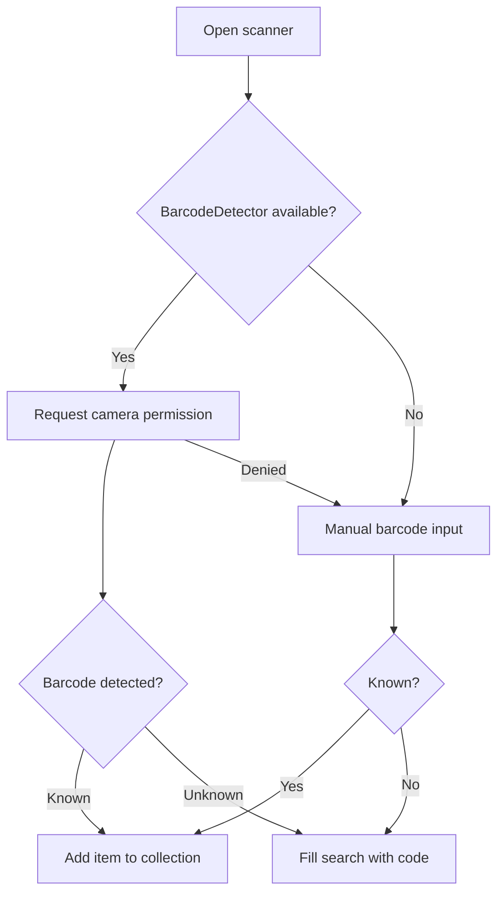

# User Guide

Anti-Kragle tracks LEGO sets and minifigs across a collection and wishlist. Collection data syncs to Supabase so it's available across devices.

## Main Screen

The app has two main areas:

- **Sidebar**: summary counters, search, barcode scanner, sync status, tabs, and item list.
- **Detail panel**: selected set or minifig image, metadata, add actions, editable fields, parts list, instructions, and missing parts.

## Search

Use the search box to find catalog items by set number, minifig number, theme, or keyword. Search chains through:

1. Local seed catalog (instant)
2. Supabase catalog cache (fast)
3. Rebrickable API (live, ~300ms debounce)

Results from Rebrickable are cached automatically so future searches are instant.

## Add an Item

From the Catalog tab:

1. Search or browse the catalog.
2. Select an item to inspect its details.
3. Click **Add to collection** to track ownership, or **Add to wishlist** to save for later.

## Collection and Wishlist

Use the tabs to switch views:

- **Catalog**: live-searchable catalog powered by Rebrickable.
- **Collection**: items you own.
- **Wishlist**: items you want.

## Detail Fields

| Field | Purpose |
| --- | --- |
| List | Moves the item between Collection and Wishlist. |
| Set quality when bought | Records condition at acquisition. |
| Building status | Not started / In progress / Complete. |
| Display location | Where the item is displayed or stored. |
| Quantity | Count of duplicates; affects estimated value total. |
| Box saved | Whether the original box was kept. |
| Missing parts | Freeform notes about missing parts (legacy field). |
| Notes | Any other ownership notes. |

Changes save to localStorage immediately and sync to Supabase every 5 minutes.

## Parts List

For any set in the detail panel, scroll to the **Parts** section:

- Parts are grouped by bag. Spare parts appear in a separate collapsible section.
- Click **CSV** or **BSX** next to a bag to export just that bag.
- Click **CSV** or **BSX** in the header to export all parts for the set.
- BSX format is compatible with BrickLink and BrickStock.
- Parts are fetched from Rebrickable on first view and cached in Supabase.

## Missing Parts

Use the **!** button on any part card to mark it as missing. Marked parts appear in the **Missing Parts** section below the full parts list:

- Click the trash icon on a missing part to remove it from the list.
- Export the missing list as CSV or BSX for ordering replacements on BrickLink.

## Building Instructions

Scroll to **Building Instructions** in the detail panel for any set:

- Download booklets directly from the LEGO.com CDN.
- If no PDFs are found, click the **LEGO.com ↗** link to browse instructions manually.

## Summary Counters

| Counter | Meaning |
| --- | --- |
| Owned | Items in the Collection list. |
| Wishlist | Items in the Wishlist list. |
| Value | Sum of estimated value × quantity for owned items. |
| Built | Items with build status Complete. |

## Barcode Scanning

Click the barcode icon beside search. The app chains: seed catalog → Supabase cache → Rebrickable live lookup.

## Cloud Sync

Collection data syncs to Supabase automatically:

- On app load (pull from cloud, reconcile with local)
- Every 5 minutes in the background
- Immediately on coming back online after being offline

The **Sync** indicator in the sidebar shows current status (idle / syncing / error / offline). Click **Retry** on error to trigger a manual sync.

## Export

In the sidebar, click **JSON** or **CSV** to download your full collection.

## Remove an Item

1. Select the item in Collection or Wishlist.
2. Click **Remove from lists** in the detail form.

The item remains visible in the Catalog tab.

## Privacy and Data

Collection data is stored in your browser (localStorage) and synced to your Supabase project. No data is shared with third parties. Parts data comes from [Rebrickable](https://rebrickable.com) and is cached in your Supabase database.
